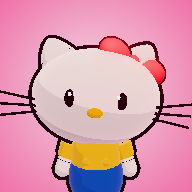
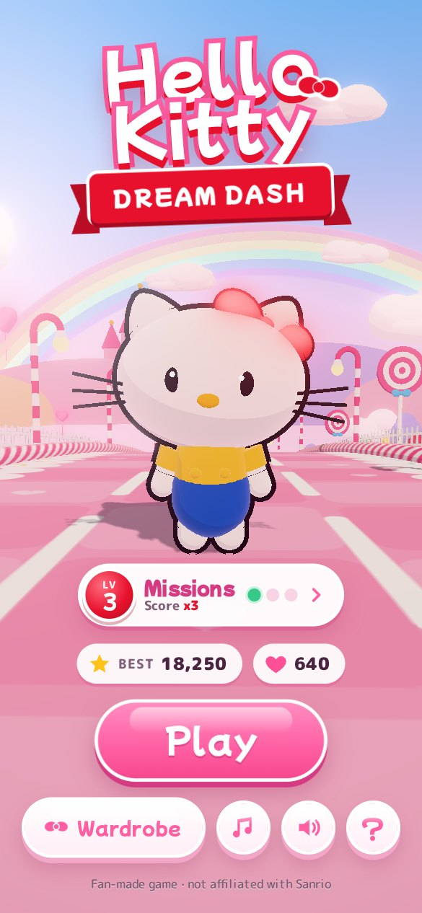
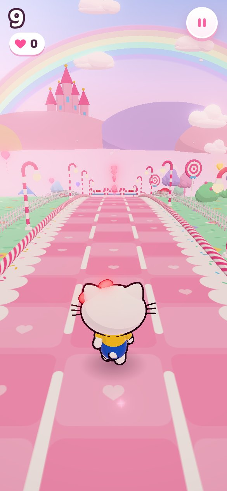
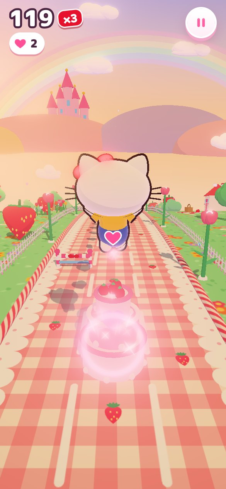
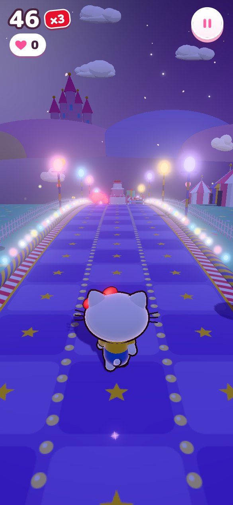
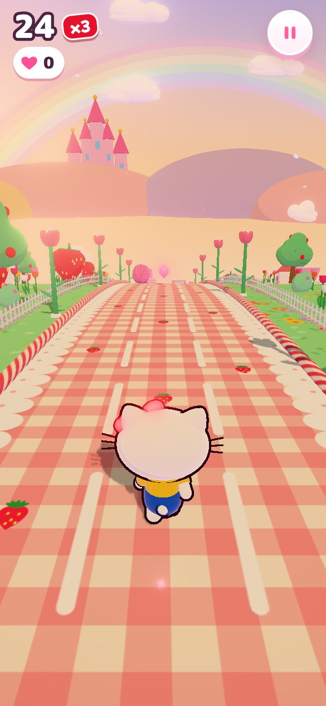
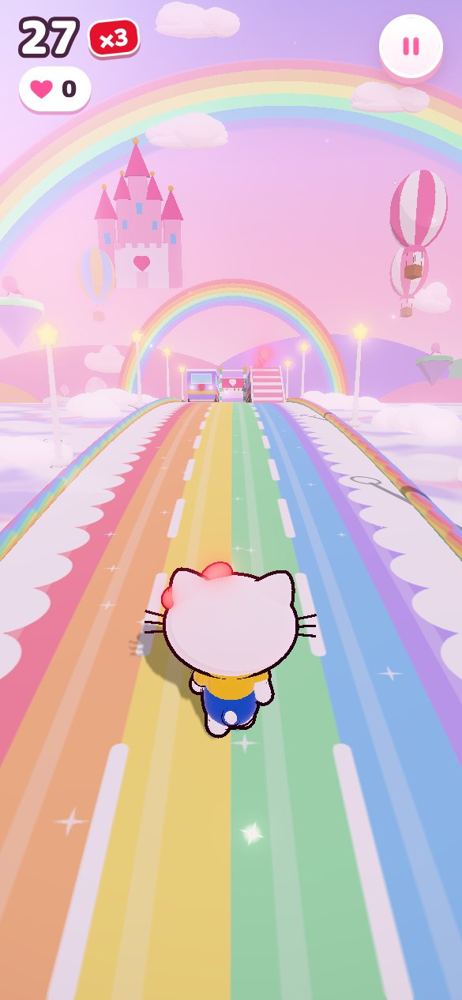
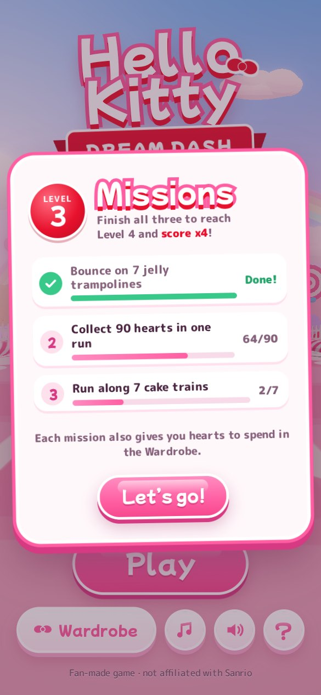
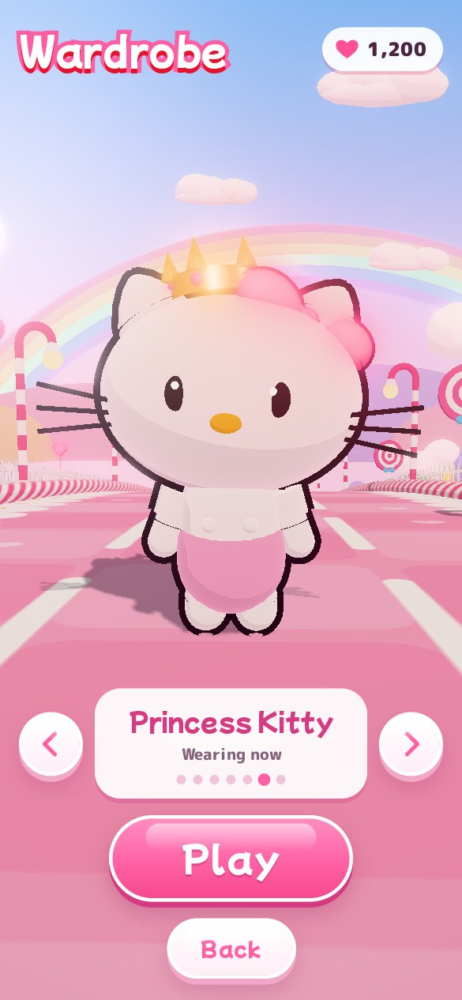

<div align="center">



# Hello Kitty Dream Dash

A fan-made 3D endless runner for your phone. Dash through four dreamy worlds, bounce on jelly trampolines, smash through with Sugar Dash, finish missions and unlock cute outfits.

## [▶ Tap here to play](https://raw.githack.com/MEGLADO/hellokitty-game/HEAD/index.html)

   

</div>

## Play on your phone

1. Open the **Tap here to play** link above on your phone (Safari on iPhone, Chrome on Android). Nothing to download or install.
2. Tap **Play**.
3. Swipe on the screen to move Kitty. Swipe left or right to change lanes, up to jump, down to slide.

No sound on iPhone? Flip the silent switch on the side of the phone off, then tap the music button.

### Make it a full-screen app

Add it to your home screen so it opens like a real app, with no browser bars:

- **iPhone:** tap the Share button, then **Add to Home Screen**.
- **Android:** tap the **⋮** menu, then **Add to Home screen** (or **Install app**).

## How to play

| Swipe | Kitty… |
| --- | --- |
| ← → | changes lanes |
| ↑ | jumps over candy fences |
| ↓ | slides under ribbon gates |

- Run up the pink ramps to ride on top of the cake trains.
- Gift towers, cakes, cupcakes and rolling yarn balls are too big to jump. Switch lanes!
- Land on a pink **jelly trampoline** to fly sky-high over everything, grabbing the hearts up there.
- Run over a glowing **dash pad** for a Sugar Dash: Kitty speeds up and smashes straight through whatever is in her way.
- Hearts are worth 10 points, shiny apples give 5 hearts at once. Grab hearts quickly one after another for a combo bonus.
- Crashed? Spend some hearts on **Save me!** to keep your run going (it costs more each time).
- On a computer: arrow keys or WASD, Space to jump, P to pause.

### Four worlds

Every 600 m Kitty runs into a new world, each with its own sky, scenery, lamps and music. Fireworks go off every 500 m.

| | |
| --- | --- |
| **Candy Town** | candy-cane lamps, lollipops, cotton candy trees and little cottages |
| **Strawberry Garden** | giant strawberries, teacups, tulips, picnics and butterflies at golden hour |
| **Cloud Kingdom** | a road in the sky with floating islands, hot air balloons and rainbow arches |
| **Starlight Carnival** | a night fair with a Ferris wheel, carousel, circus tents, fireflies and fireworks |

   

### Missions and levels

Tap **Missions** on the title screen to see your three goals, like *bounce on 5 jelly trampolines* or *reach Cloud Kingdom in one run*. Each finished mission gives you hearts. Finish all three to level up: your level is your score multiplier, so level 5 scores x5!



### Power-ups

| Bubble | What it does |
| --- | --- |
| Heart Magnet | pulls every nearby heart to Kitty |
| Rainbow Rush | Kitty flies on a cloud above everything, leaving a rainbow trail |
| Bubble Shield | saves you from one crash |
| Golden Apple | doubles every heart for a while |
| Sugar Dash (from dash pads) | a burst of speed that smashes through everything |

### Wardrobe

Spend your hearts on seven outfits: Classic Kitty, Sakura Dream, Ocean Sailor, Mint Candy, Starlight, Princess Kitty and Rainbow Magic. Your best score, hearts, level, missions and outfits are saved on your phone.



## Optional: a shorter link with GitHub Pages

The play link above works right away. If you want a shorter address like `meglado.github.io/hellokitty-game`, switch on GitHub Pages once:

1. Open the repo on github.com and go to **Settings → Pages**.
2. Under **Build and deployment**, set **Source** to **Deploy from a branch**.
3. Pick the branch `claude/upbeat-turing-2ey9n1` (or `main` if you merge it there) and the **/ (root)** folder, then **Save**.
4. After about a minute the game is live at **https://meglado.github.io/hellokitty-game/**

## What's inside

- **three.js** 3D scene with a curved "tiny planet" road, cel-shaded Kitty with outlines, real-time shadows, glowing bloom, sparkles, confetti, fireworks, a rainbow trail and speed lines
- Four themed worlds whose road, ground and scenery swap as you cross into them, with an animated Ferris wheel and carousel in the carnival
- Music and sound effects made with the Web Audio API in code, so there are no audio files. Each world plays the theme in its own style: music box pop, marimba picnic, dreamy bells and a carnival calliope
- Graphics quality lowers itself automatically on slower phones
- Everything is self-contained (the fonts are bundled too), so it also works on networks that block outside sites

## For developers

```bash
npm install
npm run build     # bundles src/ into dist/game.js and writes index.html
npm run serve     # http://localhost:8080
```

- `src/` has the game: `main.js` (game loop and states), `kitty.js`, `world.js` (worlds and scenery), `props.js` (scenery models), `track.js` (obstacles and patterns), `missions.js`, `particles.js`, `fx.js`, `audio.js`, `ui.js`
- `node tools/track-check.mjs` generates kilometres of track and checks that every stretch can be passed
- `node tools/smoke-test.mjs <out-dir> <scenario>` plays the game in a phone-sized headless browser and saves screenshots (scenarios include `run`, `crash`, `worlds`, `pads`, `missions`, `wardrobe`, `bot` and `flow`)
- `node tools/capture.mjs` renders the app icons and these screenshots
- Handy URL options: `?debug` shows FPS, `?quality=low|medium|high` forces graphics quality, `?start=1300` starts a run 1300 m in (Cloud Kingdom)

## Credits

- Built with [three.js](https://threejs.org) (MIT)
- Fonts: [Mochiy Pop One](https://fonts.google.com/specimen/Mochiy+Pop+One) and [M PLUS Rounded 1c](https://fonts.google.com/specimen/M+PLUS+Rounded+1c), both under the SIL Open Font License 1.1 (see `assets/fonts/`)

This is a fan-made game for fun. It is not affiliated with or endorsed by Sanrio. Hello Kitty is a trademark of Sanrio Co., Ltd.
